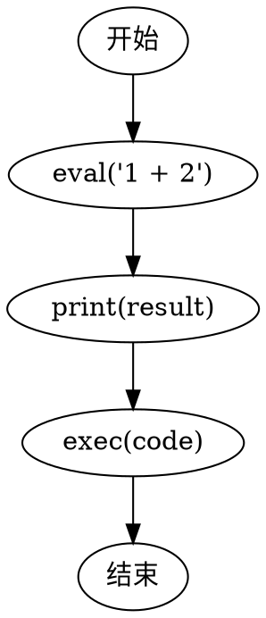

# CFG转图像过程详解

## 1. Graphviz将.gv文件转换为PNG图像的原理

Graphviz是一个图形可视化工具，它将图形描述语言(DOT语言)转换为图像。在代码中的实现过程：

```python
subprocess.run(['dot', '-Tpng', self.cfg_file, '-o', temp_image_path], 
              check=True, stdout=subprocess.PIPE, stderr=subprocess.PIPE)
```


这行代码调用了Graphviz的`dot`命令行工具，其中：
- `dot`：Graphviz的布局引擎，专门用于有向图
- `-Tpng`：指定输出格式为PNG
- `self.cfg_file`：输入的.gv文件路径(如exec_cfg.gv)
- `-o temp_image_path`：输出的临时PNG文件路径

### 工作原理：
1. Graphviz解析.gv文件中的DOT语言描述
2. 计算图中节点的位置和边的路径
3. 渲染为PNG图像，保留图的结构和连接关系

## 2. 图像处理过程

读取并处理图像的代码：

```python
# 读取图像
self.image = cv2.imread(temp_image_path)

# 调整图像大小
if self.image is not None:
    self.image = cv2.resize(self.image, self.image_size)
    
    # 转换为灰度图
    self.image = cv2.cvtColor(self.image, cv2.COLOR_BGR2GRAY)
```


### 具体实现：
1. **读取图像**：
   - `cv2.imread()` 加载PNG图像到内存，默认为BGR颜色空间
   - 返回一个NumPy数组，形状为(高度, 宽度, 3)

2. **调整图像大小**：
   - `cv2.resize()` 将图像缩放到预定义的尺寸(self.image_size)
   - 通常是正方形，如(224, 224)或(128, 128)

3. **转换为灰度图**：
   - `cv2.cvtColor()` 将BGR彩色图像转换为单通道灰度图
   - 转换后的形状为(高度, 宽度)
   - 每个像素值范围为0-255，表示亮度

## 3. 以exec_cfg.gv为例的转换过程

假设exec_cfg.gv包含以下内容(简化版)：




### 转换过程：

1. **Graphviz处理**：
   - 解析上述DOT语言
   - 创建一个自上而下的有向图布局
   - 生成PNG图像，其中包含节点(方框)和边(箭头)

2. **OpenCV处理**：
   - 读取PNG图像(彩色)
   - 调整为预定义尺寸(如128×128像素)
   - 转换为灰度图，保留结构信息但减少数据量

## 4. 可视化展示

### 原始PNG图像(彩色)：

```
+-------------------+
|                   |
|    +-------+      |
|    | 开始  |      |
|    +-------+      |
|        |          |
|        v          |
|  +------------+   |
|  |eval('1 + 2')|  |
|  +------------+   |
|        |          |
|        v          |
|  +------------+   |
|  |print(result)|  |
|  +------------+   |
|        |          |
|        v          |
|  +------------+   |
|  | exec(code) |   |
|  +------------+   |
|        |          |
|        v          |
|    +-------+      |
|    | 结束  |      |
|    +-------+      |
|                   |
+-------------------+
```


### 转换后的灰度图：

灰度图会保留相同的结构，但颜色信息被转换为灰度值：
- 背景通常是白色(255)
- 节点边框和文本是黑色或深灰色(0-50)
- 箭头是黑色或深灰色(0-50)
- 节点填充可能是浅灰色(180-220)

在灰度图中，控制流的结构清晰可见，节点之间的连接关系被保留，但没有颜色区分。这种表示方式使得机器学习模型可以专注于代码的结构特征，而不受颜色信息的干扰。

## 为什么要这样做？

将CFG转换为图像的目的是将代码的控制流结构转换为可供计算机视觉模型(如CNN)处理的格式。灰度图像：
1. 减少了数据维度
2. 保留了关键的结构信息
3. 使得不同的代码结构可以被视觉上区分
4. 允许使用成熟的计算机视觉技术来分析代码结构

这种表示方法特别适合检测恶意代码，因为许多恶意代码具有特殊的控制流结构，如混淆、反调试技术或隐藏的执行路径。